# coachtechフリマ
coachtechフリマはある企業が開発した独自のフリマアプリです。


## 作成した目的
coachtechブランドのアイテムを出品するため独自のフリマアプリを作成しました。

## アプリケーションURL
- 開発用環境  <http://localhost/>
- 本番環境  <http://54.168.65.228/>

## 機能一覧
- 基本機能
  - 会員登録機能
  - ログイン機能
  - ログアウト機能
  - 商品一覧取得
  - 商品詳細取得
  - 商品お気に入り一覧取得
  - ユーザー情報取得
  - ユーザー購入商品一覧取得
  - ユーザ出品商品一覧取得
  - プロフィール変更
  - 商品お気に入り追加
  - 商品お気に入り削除
  - 商品コメント追加
  - 商品コメント削除
  - 商品の出品
- 追加機能
  - 配送先変更機能
  - 商品購入機能
  - お支払い方法の選択・変更
  - 管理者のユーザー削除
  - 管理者のユーザーコメント削除
  - 管理者のメール送信
  - レスポンシブデザイン

## 使用技術（実行環境）
- フレームワーク
  - Laravel 8.83.8
  - Vue.js 2.7.16
- 言語
  - php
  - html
  - css
  - javascript
- ライブラリ、ツール及びサービス
  - Fortify
  - Laravel-admin
  - Stripe
  - AWS (EC2, RDS, S3)

## テーブル設計
Usersテーブル
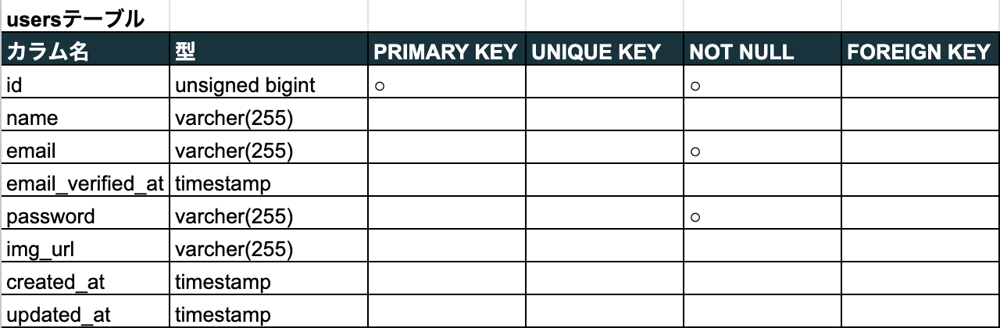  
Profilesテーブル
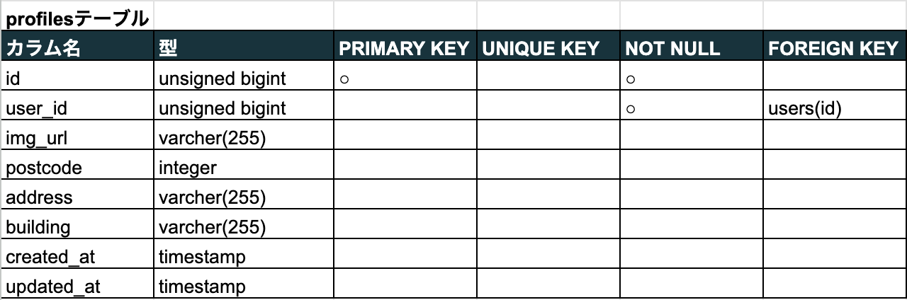  
Itemsテーブル
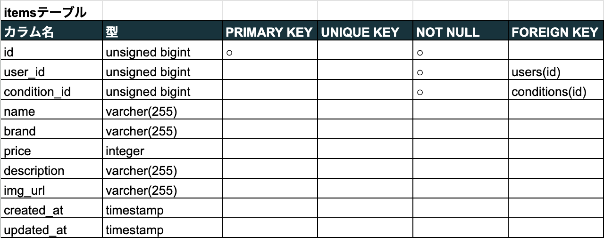  
Conditionsテーブル
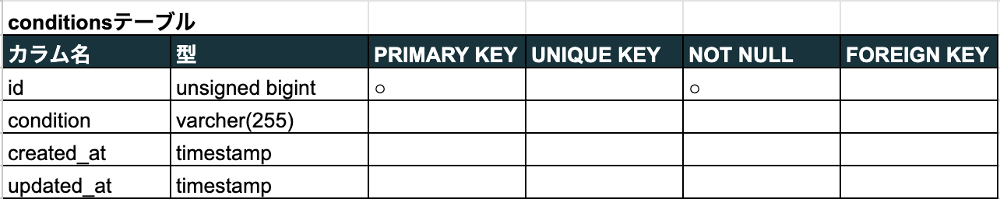  
Categoriesテーブル
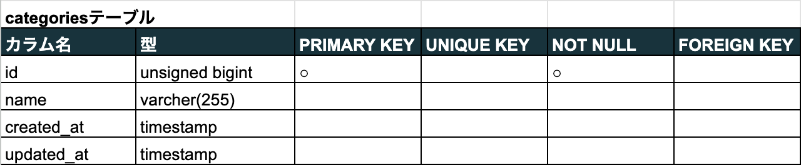  
Likesテーブル
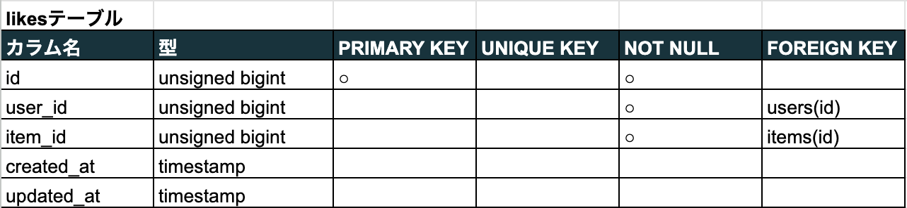  
Commentsテーブル
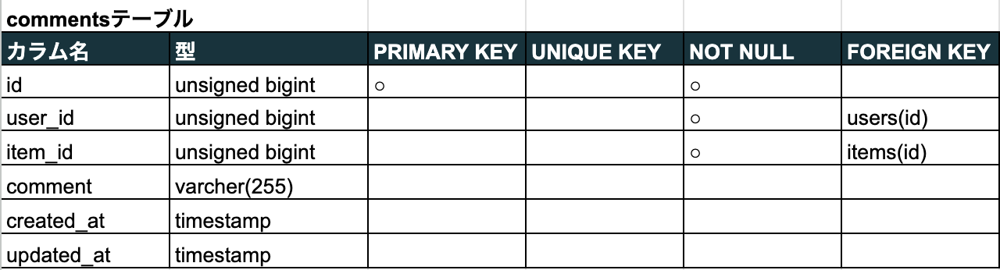  
Sold_itemsテーブル
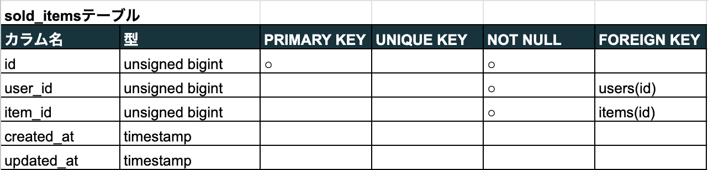  
Category_itemsテーブル
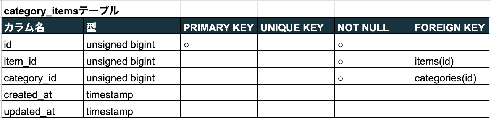

## ER図


## 環境構築
### プロジェクトのセットアップ手順
#### ディレクトリの作成
アプリケーションを作成するために、開発環境を GitHub からクローンします。  
`laravel-docker-template.git`をクローンしてください。
```bash
$ git clone git@github.com:coachtech-material/laravel-docker-template.git
```
#### Docker の設定
複数のコンテナを扱うのでdocker-composeを使います。
```bash
$ docker-compose up -d --build
$ code .
```
#### Laravel のパッケージのインストール
docker-composeコマンドで PHPコンテナ内にログインし、composerコマンドを使って必要なパッケージをインストールします。
```bash
$ docker-compose exec php bash
$ composer install
```
#### .envファイルの作成
.envファイルは、.env.exampleファイルをコピーして作成します。
```bash
$ cp .env.example .env
$ exit
```
.envファイルは以下のように修正します。
```
// 前略
DB_CONNECTION=mysql
DB_HOST=mysql
DB_PORT=3306
DB_DATABASE=laravel_db
DB_USERNAME=laravel_user
DB_PASSWORD=laravel_pass
// 後略
```
#### viewファイルの作成
各ページのviewファイルを作成します。
resources/viewsに、以下のBladeファイルを作成します。
- top.blade.php　&emsp;...トップページ
- item.blade.php  &emsp;...商品詳細ページ
- purchase.blade.php  &emsp;...購入ページ
- payment.blade.php  &emsp;...決済方法選択ページ
- address.blade.php  &emsp;...配送住所変更ページ
- mypage.blade.php  &emsp;...マイページ
- profile.blade.php  &emsp;...プロフィール変更ページ
- sell.blade.php  &emsp;...商品出品ページ

resources/views/authには以下のBladeファイルを作成します。
- login.blade.php  &emsp;...ログインページ
- register.blade.php  &emsp;...会員登録ページ

resources/views/layoutsには以下のBladeファイルを作成します。
- app.blade.php  &emsp;...ヘッダー

また、非同期の機能を記述するために、resources/js/componentsには以下のファイルを作成します。
- CommentComponent.vue&  &emsp;...コメント機能
- LikeComponent.Vue &emsp;...お気に入り機能
- MypsgeComponent.Vue &emsp;...お気に入りまたは購入商品切り替え機能
- ProfileComponent.Vue &emsp;...プロフィール変更機能
- SellComponent.Vue &emsp;...商品出品機能
- TopComponent.Vue &emsp;...お気に入り商品切り替え機能

#### cssファイルの作成
public/cssに以下のcssファイルを配置します。
- top.css
- address.css
- comment.css
- item.css
- like.css
- login.css
- mypage.css
- payment.css
- profile.css
- register.css
- sell.css
- purchase.css
- common.css
- sanitize.css

#### RouteとControllerの作成
Controllerファイルを作成し、以下のルート及びアクションを紐付けします。
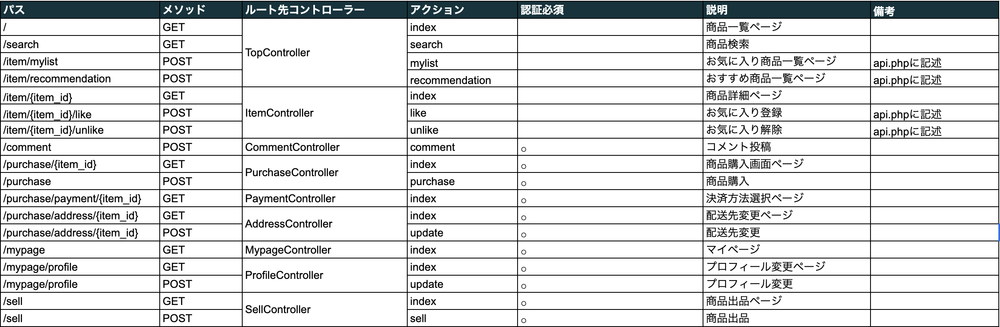

#### Modelの作成
各モデルを作成します。
- User.php
- Item.php
- Profile.php
- Category.php
- CategoryItem.php
- Comment.php
- Likes.php
- SoldItem.php
- Condition.php

#### バリデーションの作成
各ファイルを作成します。  
なお、ログインや登録の際のバリデーションはFortifyに備わる機能を使用しました。
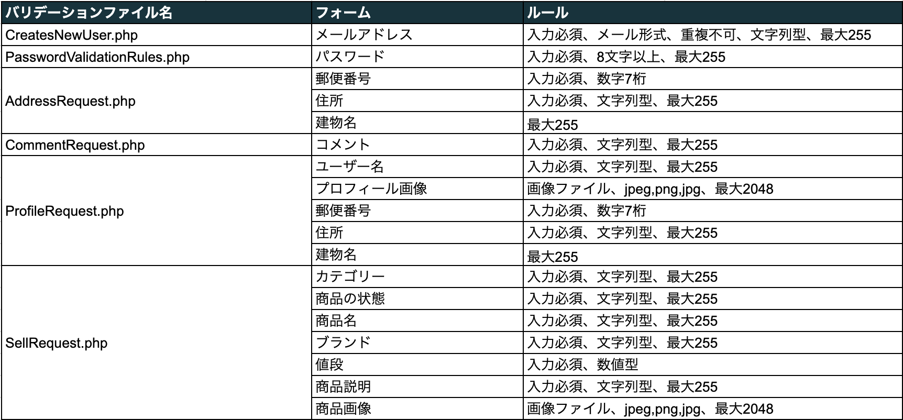

<br></br>
### 会員登録・ログイン機能
ユーザーの会員登録・ログイン機能はFortifyを使用して実装しました。
##### Fortifyの導入
Laravelをインストールしたプロジェクト内でfortifyをインストールし、関連ファイルを作成します。
その後、マイグレートを実行します。
```bash
$ composer require laravel/fortify
$ php artisan migrate
$ php artisan vendor:publish --provider="Laravel\Fortify\FortifyServiceProvider"
```

<br></br>
### 非同期機能
非同期の機能を実装するため、Vue.jsを使用しました。
##### Vue.jsの導入
下記コマンドでpackage.jsonに記述されているパッケージをインストールします。
```
$ npm install vue@next vue-loader@next
$ npm install -D tailwindcss
```
プロジェクトをビルドして編集を反映させます。
```
$ npm run watch
```

<br></br>
### 管理画面の構築
管理画面を作成するにあたり、Laravel-adminというライブラリを使用しました。
以下のコマンドの流れでセットアップします。
```
$ composer require encore/laravel-admin:1.*
$ php artisan vendor:publish --provider="Encore\Admin\AdminServiceProvider"
$ php artisan admin:install
```  
以下のURLにアクセスすることで管理ページを閲覧できます。  
URL: http://localhost:8000/admin (本番環境は http://54.168.65.228/admin)  

管理画面では、画面左のusersタブからusersテーブルを確認でき、ユーザーの削除を行うことができます。  
commentタブでcommentsテーブルを確認でき、コメントの削除を行うことができます。  
emailタブでは管理者側からユーザーにメール送信できます。  

※管理人のアカウントは作成済みです。  
使用する前に以下で管理者情報を作成できます。
```
$ php artisan db:seed
```  
なお、ID、パスワードは以下になります。
- ユーザーID　&emsp;...admiin
- パスワード　&emsp;...admiin

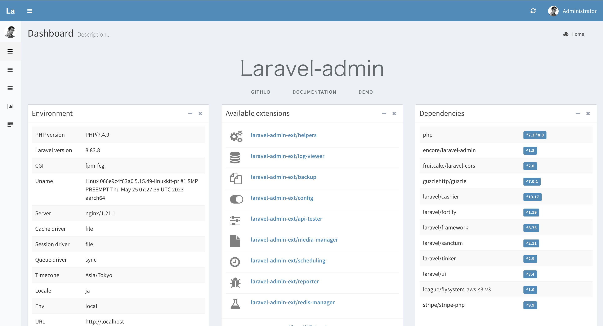

<br></br>
### クレジット決済の導入
クレジットカードで決済するにあたり、Stripeというツールを使用しました。
以下のコマンドでLaravel Cashierをインストールします。
```
$ composer require “laravel/cashier”:”~7.0″
```
Stripで取得したAPIキーを.envに記述します。
```
STRIPE_KEY=公開可能キー
STRIPE_SECRET=シークレットキー
```
決済情報は以下のURLで確認できます。  
URL: https://dashboard.stripe.com/test/dashboard  

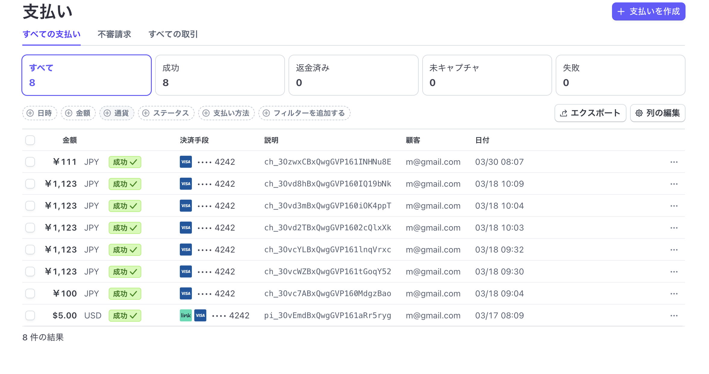

<br></br>
### 本番環境の構築
#### EC2の環境構築
AWSにてEC2インスタンスを作成後、Amazon Linux 2にログインします。  
以下のライブラリをインストトールします。
- nginx
- php-fpm
- composer

#### RDSの環境構築
AWSにてRDSでデータベースを作成します。  
Amazon Linux 2にログイン後、MySQLをインストールします。  
上記で使用したC2インスタンスにRDSのセキュリティグループを設定します。  
.envにて以下の項目を編集する。
```
DB_CONNECTION=mysql
DB_HOST=エンドポイント
DB_PORT=3306
DB_DATABASE=laravel
DB_USERNAME=マスターユーザー名
DB_PASSWORD=マスターパスワード
```

#### S3の環境構築
AWSにてS3でバケットを作成します。  
.envにて以下の項目を編集する。
```
AWS_ACCESS_KEY_ID=アクセスキーID
AWS_SECRET_ACCESS_KEY=IAMユーザーのシークレットアクセスキー
AWS_DEFAULT_REGION=ap-northeast-1
AWS_BUCKET=バケット名
AWS_USE_PATH_STYLE_ENDPOINT=false
```
バケット内のオブジェクトは以下になります。
- item/ &emsp;...商品画像を保存するフォルダ
- user/　&emsp;...ユーザーのプロフィール画像を保存するフォルダ
- no-image.jpg　&emsp;...商品及びユーザーのプロフィール画像が選択されていない場合に使用する画像ファイル
